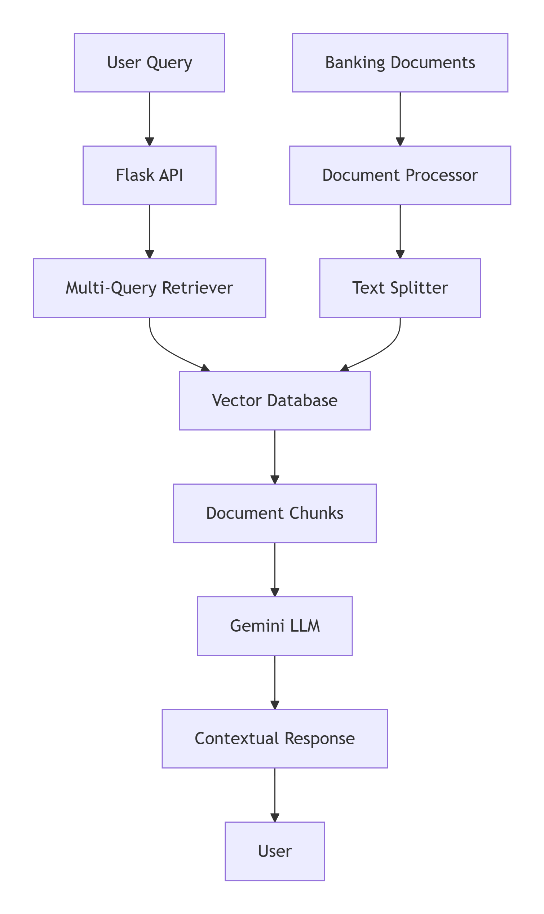

# Banking RAG Chatbot API

<div align="center">


**AI-powered Banking Customer Service Chatbot**  
*Revolutionizing banking support with Retrieval-Augmented Generation technology*

[Features](#-features) • [Architecture](#-architecture) • [Quick Start](#-quick-start) • [API Docs](#-api-documentation)

</div>

## Overview

Banking RAG Chatbot API is a sophisticated Flask-based application that provides intelligent banking customer support using Google Gemini AI and advanced document retrieval. The system can process banking documents, understand customer queries, and provide accurate, context-aware responses based on your banking products and policies.

### Use Cases

- **Customer Support**: Instant answers about banking products and services
- **Document Management**: Upload and process banking policy documents
- **Multi-query Retrieval**: Advanced search across banking documentation
- **API Integration**: Easy integration with existing banking systems

## Features

| Feature | Description |
|---------|-------------|
| **Multi-Query RAG** | Automatically generates multiple query variations for better retrieval |
| **Document Processing** | Supports Markdown and Excel files with dynamic header extraction |
| **CORS Enabled** | Ready for web and mobile applications |
| **Gemini AI Integration** | Powered by Google's latest Gemini Flash model |
| **Vector Database** | ChromaDB for efficient document retrieval |
| **Real-time Updates** | Dynamic document management without downtime |

## Architecture


## Quickstart
### Prerequisites
* Python 3.9+
* Google Gemini API Key
* 8GB RAM minimum

### Installation
**1. Clone the repository**
   ```

   git clone https://github.com/FathiAriaFirdaus/banking-rag-api-gemini.git

   banking-rag-api-gemini

   ```

**2. Set up environment**
   ```

   python -m venv venv

   source venv/bin/activate

   ```

**3. Install dependencies**
   ```

   pip install -r requirements.txt

   ```

**4. Configure environment variable**
   ```

   APP_API_KEY=your_secret_api_key_here

   GEMINI_API_KEY=your_gemini_api_key_here

   ```
**5. Run the application**
   ```

   python app.py

   ```

## API Documentation

### Base URL

```
base-url: http://loaclhost:5000
```

### Authentication
All API endpoints require authentication using an API key sent in the request header.

**Header:**
```
x-api-key: your_secret_api_key_here
```
---

### Chat Endpoint

```
POST /api/chat
Content-Type: application/json

{
    "message": "What are the requirements for opening a savings account?"
}
```

**Response**
```
{
    "success": true,
    "response_message": "To open a savings account, you need...",
    "request_message": "What are the requirements for opening a savings account?"
}
```
---

### Document Management

**Upload Documents** (Add to existing)
```
POST /api/documents/add
Content-Type: multipart/form-data

file: banking-products.md
```

**Replace All Documents**
```
POST /api/documents
Content-Type: multipart/form-data

file: new-policies.md
```

**Get All Documents**
```

GET /api/documents

```

**Delete All Documents**
```

DELETE /api/documents

```
---

**Health Check**
```

GET /api/health

```
**Response:**
```
{
    "status": "healthy",
    "documents": 45
}
```
---


## Supported Document Format
* **Markdown (.md)**: Automatic header-based chunking


